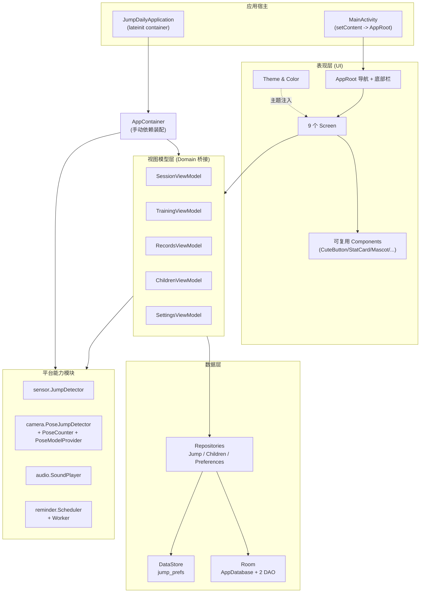
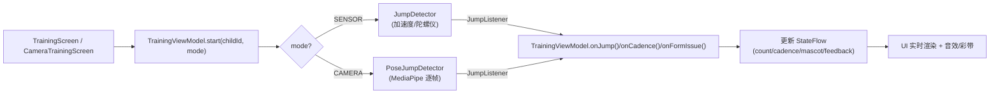
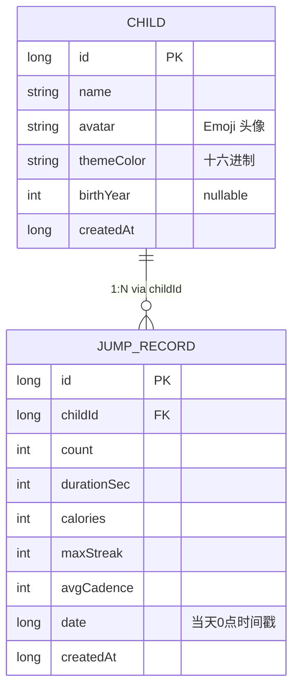

# JumpDaily「跳一跳」架构设计文档

> 项目：JumpDaily（包名 `com.jumpdaily.jump`） · 儿童跳绳计数 App
> 编写日期：2026-09-01 · 基于当前代码快照（Kotlin 1.9.24 + Compose 1.5.14 + AGP 8.5.2）
> 配套文档：[README.md](./README.md) · [CHANGELOG.md](./CHANGELOG.md) · [TECH_STACK.md](./TECH_STACK.md)（每项技术核心思想与用法详解）

---

## 目录

- [1. 系统概述与目标](#1-系统概述与目标)
- [2. 技术栈](#2-技术栈)
- [3. 架构总览](#3-架构总览)
- [4. 分层职责详解](#4-分层职责详解)
  - [4.1 表现层（UI）](#41-表现层ui)
  - [4.2 视图模型层（Domain 桥接）](#42-视图模型层domain-桥接)
  - [4.3 数据层](#43-数据层)
  - [4.4 平台能力模块](#44-平台能力模块)
  - [4.5 依赖装配（DI）](#45-依赖装配di)
- [5. 关键业务流程](#5-关键业务流程)
  - [5.1 跳绳计数（双通路统一接口）](#51-跳绳计数双通路统一接口)
  - [5.2 训练结果落库与统计聚合](#52-训练结果落库与统计聚合)
  - [5.3 主题切换（浅色 / 夜间）](#53-主题切换浅色--夜间)
  - [5.4 每日提醒](#54-每日提醒)
  - [5.5 应用启动与种子数据](#55-应用启动与种子数据)
  - [5.6 训练中返回：挂起 / 清零](#56-训练中返回挂起--清零)
- [6. 数据模型](#6-数据模型)
- [7. 设计原则与关键决策](#7-设计原则与关键决策)
- [8. 工程与构建配置](#8-工程与构建配置)
- [9. 测试策略](#9-测试策略)
- [10. 已知限制与演进路线](#10-已知限制与演进路线)
- [11. 目录结构速查](#11-目录结构速查)
- [12. 深度专题文档（Deep Dives）](#12-深度专题文档deep-dives)

---

## 1. 系统概述与目标

JumpDaily 是一款面向**儿童 / 亲子**场景的跳绳计数与激励应用，核心目标：

1. **计数**：支持两种计数方式——手机传感器启发式（默认）、摄像头姿态估计（MediaPipe PoseLandmarker）。
2. **激励**：实时音效、Lottie 彩带动画、吉祥物情绪反馈、成就徽章，让跳绳「好玩」。
3. **留存**：每日目标、连续打卡、周柱状图统计、历史记录、可切换多孩子档案。
4. **陪伴**：每日定时提醒（WorkManager 通知）。

设计基调为「糖果卡哇伊」：低饱和高明亮的紫/粉/黄/薄荷配色，圆角大按钮，Emoji 头像与文案。

---

## 2. 技术栈

| 领域 | 选型 |
|------|------|
| 语言 | Kotlin 1.9.24（JVM 17） |
| UI | Jetpack Compose（Compiler 1.5.14，BOM 2024.09.00）+ Material3 |
| 导航 | Navigation Compose 2.7.7 |
| 本地数据库 | Room 2.6.1（`room-ktx` 协程化） |
| 偏好设置 | DataStore Preferences 1.1.1 |
| 传感器计数 | Android SensorManager（加速度计 + 陀螺仪） |
| 摄像头计数 | CameraX 1.3.1 + MediaPipe Tasks Vision 0.10.14（PoseLandmarker） |
| 动画 | Lottie Compose 6.5.2、Compose `animate*` |
| 提醒 | WorkManager 2.9.1 |
| 音效 | MediaPlayer + AudioTrack 实时合成回退 |
| 依赖注入 | **手动 DI**（`AppContainer`），无 Hilt |
| 构建 | Gradle 8.9 wrapper + AGP 8.5.2（`kapt` 注解处理） |
| 测试 | JUnit4（单元）+ Espresso（插桩，预留） |

> 每项技术的**核心思想、本项目真实用法、关键 API 与踩坑注意**，见配套文档 [TECH_STACK.md](./TECH_STACK.md)。

> 注：Compose 编译器版本必须匹配 Kotlin 主版本（1.5.14 ⇔ Kotlin 1.9.24），否则编译报 `This version of the Compose Compiler requires Kotlin version ...`。

---

## 3. 架构总览

采用 **分层 + 单向数据流（UDF）** 架构：UI 只渲染 `StateFlow` 快照、通过事件回调通知 ViewModel；ViewModel 持有状态、调用平台能力/仓库；仓库屏蔽数据源细节。



**依赖方向**（自上而下，无环）：`UI → VM → 数据层/平台模块`，`AppContainer` 自顶向下装配全部依赖，模块之间不直接相互依赖。

---

## 4. 分层职责详解

### 4.1 表现层（UI）

| 包 | 职责 |
|----|------|
| `ui.screens` | 9 个页面，纯 Composable，从 `viewModel` 读状态、`onEvent` 回调改状态，不含业务逻辑 |
| `ui.components` | 复用组件：`CuteButton`（圆角按钮，自适应文字色）、`StatCard`、`JumpMascot`（吉祥物情绪）、`LottiePlayer`、`Confetti`、`FeedbackBanner`、`WeeklyBarChart`、`ChildAvatar` |
| `ui.theme` | `Color.kt` 糖果色板 + `Theme.kt` 浅/夜间两套 `MaterialTheme` |
| `ui.navigation` | `AppRoot`（根 Composable，持有 `NavHostController` 与底部导航栏）、`Screen` 路由密封类 |

页面清单（路由由 `Screen` 密封类定义）：

`Splash → Home / Training / CameraTraining / Stats / History / Achievements / Children / Settings`

底部栏固定展示：首页、统计、历史、成就；训练/摄像头训练/启动页隐藏底部栏（沉浸全屏）。

### 4.2 视图模型层（Domain 桥接）

所有 ViewModel 均以 `StateFlow` 向 UI 暴露不可变状态，通过 `stateIn(viewModelScope, WhileSubscribed(5000), 初始值)` 转为热流；事件通过普通 `fun` 触发。每个 VM 自带 `Factory`（无 Hilt，手动创建）。

| ViewModel | 职责 | 关键状态 |
|-----------|------|----------|
| `SessionViewModel` | 会话级（activity 作用域），当前孩子 + 孩子列表 + 全局偏好（音效/灵敏度/目标/计数方式）；首次启动种示例孩子 | `currentChild`、`children`、`soundEnabled`、`sensitivity`、`dailyGoal`、`weeklyGoal`、`countMode` |
| `TrainingViewModel` | 训练核心：驱动计数、实时反馈（吉祥物/彩带/音效）、计时、结果落库 | `count`、`elapsed`、`cadence`、`running`、`paused`、`mascot`、`feedback`、`confetti`、`result`、`goalReached` |
| `RecordsViewModel` | 统计/历史/成就三页共享：`flatMapLatest(childId)` 派生记录、统计、徽章、周柱状图 | `records`、`stats`、`badges`、`weekly` |
| `ChildrenViewModel` | 孩子增删改查与切换 | `children` |
| `SettingsViewModel` | 提醒开关/时间、音效、灵敏度、目标、主题、计数方式；改动写 DataStore 并联动 `ReminderScheduler` | 各偏好 `StateFlow` |

**统一反馈链路**（仅 `TrainingViewModel`）：`onJump()` 每满 10 个触发奖励 → `triggerReward()` 置 `confetti=true` + 音效 + 吉祥物 `HAPPY`；节奏过低 → `triggerCheer()`；陀螺仪检测挥手机 → `onFormIssue()` 纠正提示。

### 4.3 数据层

遵循 **Repository 模式**，UI/VM 不直接触碰 Room/DataStore。

**Room（结构化数据，`jump_daily.db`）**
- `AppDatabase`：单例（`@Volatile INSTANCE` + `synchronized`），`version=1`，`fallbackToDestructiveMigration`（演示期结构变更直接重建）。
- DAO：`JumpRecordDao`、`ChildDao`，查询返回 `Flow` 实现响应式观察。
- 实体：`JumpRecord`（训练记录）、`Child`（孩子档案）。

**DataStore（键值偏好，`jump_prefs`）**
- `PreferencesRepository`：类型安全地封装当前孩子 ID、提醒设置、音效/音乐开关、灵敏度、每日/每周目标、夜间模式、**计数方式 `CountMode`**、是否已种子。所有读取为 `Flow`。

**聚合计算**
- `JumpRepository.stats()` 用 `combine()` 把 5 个 Room 查询聚合成 `Stats` 快照（含 `computeStreak` 连续打卡天数）。
- `BadgeCatalog.evaluate(Stats)` 用纯函数谓词判定成就解锁，可单测。

### 4.4 平台能力模块

| 模块 | 类 | 说明 |
|------|----|------|
| `sensor` | `JumpDetector` + `JumpListener` | 加速度计检测落地冲击峰值计数，陀螺仪检测挥手机提醒；回调在传感器线程，消费方自行切主线程 |
| `camera` | `PoseJumpDetector`、`PoseCounter`、`PoseModelProvider` | MediaPipe LIVE_STREAM 逐帧检测髋中心 y，滞回算法计次；模型 assets 优先、缓存次之、联网下载兜底 |
| `audio` | `SoundPlayer` | 素材优先（`res/raw`），失败回退 AudioTrack 实时合成；含震动反馈 |
| `reminder` | `ReminderScheduler`、`ReminderWorker` | WorkManager 24h 周期任务，到点弹通知 |

**关键设计**：传感器与摄像头两套计数共用 `JumpListener` 接口（`onJump()/onCadence()/onFormIssue()`），训练页可无缝切换，计数逻辑对 UI 透明。

### 4.5 依赖装配（DI）

无 Hilt，集中在 `AppContainer` 手工 `new`：

```
JumpDailyApplication.onCreate → AppContainer(this)
  ├─ AppDatabase.getInstance(app)
  ├─ JumpRepository / ChildrenRepository / PreferencesRepository
  ├─ SoundPlayer / SensorManager / ReminderScheduler
  └─ 5 个 ViewModel.Factory
```

`MainActivity` 取 `application.container` 传给 `AppRoot`，各页面经 `viewModel(factory = container.xxxFactory)` 获取 VM。

---

## 5. 关键业务流程

### 5.1 跳绳计数（双通路统一接口）



- **传感器**：落地冲击 `mag > G*1.6/sensitivity` 且 `airborne` 为真（先有腾空 `mag<0.5G`）才计一次，避免「起跳那一下」被重复记。
- **摄像头**：髋中心归一化 y 相对滑动基线的滞回（`dev<-thr` 起跳、`dev>thr` 落地），`thr=0.025/sensitivity`。

两者本质都是「滞回 + 最小间隔去抖」的启发式，适合趣味场景，非竞技级精度。

### 5.2 训练结果落库与统计聚合

```
TrainingViewModel.stop()
  → detector.stop() + 计时停止
  → 组装 JumpRecord(count,durationSec,calories,maxStreak,avgCadence,date=dayStart(now))
  → jumpRepository.save(record)   // Room insert
  → 再次读取 todayCount(before/after) 判断本次是否「跨过每日目标线」
      跨过 → goalReached=true + reward 音效
  → _result = TrainingResult(...)  // 结果页展示
```

`RecordsViewModel` 通过 `flatMapLatest(childId)` 自动跟随当前孩子刷新 `records/stats/badges/weekly`；UI 只需 `collectAsStateWithLifecycle`。

### 5.3 主题切换（浅色 / 夜间）

```
SettingsViewModel.setDarkTheme(enabled) → PreferencesRepository → DataStore
  → AppRoot 读 prefsRepository.darkTheme.collectAsStateWithLifecycle(initialValue=false)
  → JumpDailyTheme(darkTheme = ...) 重组整棵 UI 树
```

`JumpDailyTheme` 提供 `Light` / `Dark` 两套 `Colors`，深色用深空紫蓝底 + 浅薰衣草字，护眼且保留卡哇伊氛围。

### 5.4 每日提醒

```
SettingsViewModel.setReminder(true, h, m)
  → ReminderScheduler.schedule(h, m)
     计算到下一次 h:m 的 initialDelay
     WorkManager.enqueueUniquePeriodicWork("daily_reminder", 24h)
  → 到点 ReminderWorker.doWork() → 弹通知（点按回 MainActivity）
关闭提醒 → scheduler.cancel()
```

需 `POST_NOTIFICATIONS` 权限（Android 13+ 在 `MainActivity` 申请）。

### 5.5 应用启动与种子数据

```
MainActivity.setContent { AppRoot }
  → SessionViewModel.init: childrenRepo.children.first()
      空 → 种示例孩子「小跳 🐰」+ markSeeded + 设为 currentChild
      非空 → 取 DataStore 保存的 currentChildId（无则取首个）
  → RecordsViewModel.setChild(currentChild?.id) 触发全量派生
  → SplashScreen 短暂展示后跳 Home
```

### 5.6 训练中返回：挂起 / 清零（退出保护）

`CameraTrainingScreen` 用 `BackHandler` 拦截系统返回，仅在「`running || paused` 且 `count > 0` 且未出结果页」时触发：

```
onBack -> if (running||paused && count>0 && result==null) {
    vm.pause()                       // 先停计时与分析
    showExitDialog()                 // 三选框：继续 / 挂起 / 清零
}
```

- **继续**：留在当前页，`vm.resume(childId)` 恢复训练（重新绑定当前孩子、恢复计时）。
- **挂起**：复用 §5.2 的挂起快照机制，浮条显示「⏸ 已跳 X 个 · 时长」。下次进入训练页按 `sessionMode` 回对应训练页续跳。
- **清零**：`vm.discard()` 清空内存会话与挂起快照（**不落库、不攒积分**），首页浮条因 `tCount > 0` 守卫不再显示。
- `AppRoot` 浮条可见性新增 `tCount > 0` 条件，确保清零后不会残留挂起浮条。
```

---

## 6. 数据模型

### 实体关系



### 偏好键（DataStore `jump_prefs`）

| Key | 类型 | 默认 | 含义 |
|-----|------|------|------|
| `current_child_id` | long | — | 当前选中孩子 |
| `reminder_enabled/hour/minute` | bool/int/int | false / 19 / 0 | 每日提醒 |
| `sound_enabled` / `music_enabled` | bool | true / true | 音效 / 背景音乐 |
| `sensitivity` | float | 1.0 | 计数灵敏度（0.5~1.5） |
| `daily_goal` / `weekly_goal` | int | 100 / 700 | 目标 |
| `dark_theme` | bool | false | 夜间模式 |
| `count_mode` | string | sensor | 计数方式（sensor/camera） |
| `seed_done` | bool | false | 是否已种子 |

### 派生模型

- `Stats`：`totalCount / bestCount / activeDays / streak / todayCount / history`
- `Badge`：`id / title / emoji / desc / isUnlocked(Stats)->Boolean`（`BadgeCatalog.ALL` 内置 10 个成就）

---

## 7. 设计原则与关键决策

1. **单向数据流（UDF）**：UI 只读 `StateFlow`、只发事件，状态唯一真源在 ViewModel，便于推理与单测。
2. **响应式优先**：Room DAO / DataStore 均返回 `Flow`，配合 `collectAsStateWithLifecycle` 自动感知生命周期、无手动刷新。
3. **Repository 屏蔽数据源**：VM 不直接依赖 Room/DataStore，后续可替换/加云同步而不动 UI。
4. **双计数算法统一接口**：`JumpListener` 让传感器/摄像头对训练页透明，新增计数源（如手表蓝牙）只需实现同一接口。
5. **计数算法与 Android 解耦**：`PoseCounter`、`JumpDetector` 为纯 Kotlin 逻辑，已在 `PoseCounterTest` 单测；`DateUtils` 的 `computeStreak/dayStart` 在 `DateUtilsTest` 单测。
6. **手动 DI 而非 Hilt**：项目体量小、依赖图扁平，手写 `AppContainer` 零额外注解处理开销，可读性好；代价是新增依赖需手动接线。
7. **模型加载离线优先**：`PoseModelProvider` 按 `assets → filesDir 缓存 → 联网下载` 三级回退，避免强依赖网络；国内 `storage.googleapis.com` 可能直连失败，推荐把 `pose_landmarker.task` 放 `app/src/main/assets/`。
8. **音效永不中断**：素材缺失自动回退 AudioTrack 合成，保证反馈链路稳定。

---

## 8. 工程与构建配置

| 项 | 值 |
|----|----|
| `compileSdk` / `targetSdk` / `minSdk` | 34 / 34 / 26（Android 8.0+） |
| Kotlin / Compose Compiler | 1.9.24 / 1.5.14 |
| AGP / Gradle wrapper | 8.5.2 / 8.9（AGP 8.5 不兼容 Gradle 9，故锁 8.9） |
| Java 兼容性 | 17 |
| 签名 | `signingConfigs.release` 从 `local.properties` 读 `KEYSTORE_*`；未配置则不签名，不影响 debug |
| 混淆 | release `isMinifyEnabled=false`（演示期关闭） |
| 包的排除 | `META-INF/{AL2.0,LGPL2.1}`（MediaPipe 许可文件冲突） |

> 依赖源：本机使用阿里云镜像 `maven.aliyun.com/repository/google` 拉取 `com.google.mediapipe:tasks-vision`，仓库未配置 `google()` 源。

### 多渠道打包（flavor）
`app/build.gradle.kts` 以 `flavorDimensions("channel")` 区分发布渠道，当前三渠道：

| flavor | 含义 | 产物目录 |
|--------|------|----------|
| `official` | 官方通用包（默认兜底） | `apk/official/...` |
| `huawei` | 华为应用市场 | `apk/huawei/...` |
| `xiaomi` | 小米商店 | `apk/xiaomi/...` |

每个 flavor 组合 `debug`/`release` 共 6 个变体；渠道号经 `manifestPlaceholders["CHANNEL_VALUE"]` 注入 `AndroidManifest.xml` 的 `<meta-data android:name="CHANNEL">`，运行时读 `packageManager.getApplicationInfo(...).metaData.getString("CHANNEL")` 或 `BuildConfig.FLAVOR`。新增渠道只需在 `productFlavors` 照抄 `create("渠道名")` 块，无需改 Manifest。

### 安装包命名与一键打包
- 命名：`applicationVariants.all` 把产物重命名为 `JumpDaily_v<版本>_<渠道>_<类型>_<日期>.apk`（如 `JumpDaily_v1.0.0_huawei_release_20260907.apk`）。
- 一键脚本：`tools/build_apk.bat`（Windows）与 `tools/build_apk.sh`（Git Bash / Linux / macOS），参数 `[all|official|huawei|xiaomi] [release|debug] [install]`，自动定位 `JAVA_HOME`/`ANDROID_HOME` → 构建 → 归档 `dist\<日期>\` → 列清单；带 `install` 末尾自动 `adb install`。脚本头部写死 JDK/SDK 路径，换机改一处即可。

---

## 9. 测试策略

| 测试 | 位置 | 覆盖 |
|------|------|------|
| `PoseCounterTest` | `app/src/test/java/.../camera` | 摄像头计数算法（起跳/落地滞回、去抖、频率估算） |
| `DateUtilsTest` | `app/src/test/java/.../util` | `dayStart`、`computeStreak` 连续打卡计算 |

运行：`./gradlew testDebugUnitTest`。

**待补**：UI 层（`composeTestRule`）尚未覆盖；`JumpDetector` 依赖 `SensorManager` 需 `Robolectric`/插桩；`BadgeCatalog` 谓词可加纯函数单测。

---

## 10. 已知限制与演进路线

**已知限制**
- 摄像头模式需真机 + `pose_landmarker.task` 模型文件（约 5MB），模拟器/无模型时不可用。
- Room `fallbackToDestructiveMigration`：结构变更会清空数据，正式版需补 `Migration`。
- 无账号体系与云同步，数据仅本机 Room；换设备/卸载即丢失。
- 手动 DI：依赖图扩大后接线成本上升。
- `minSdk 26` 部分 Compose/MediaPipe API 需谨慎。

**演进路线（建议）**
1. 摄像头模式真机验证 + 模型内置/下载可用性优化（国内镜像/CDN）。
2. Room 迁移脚本 + 自动备份（Auto Backup / 导出 CSV）。
3. 多计数源抽象为 `CountingEngine` 接口（统一 SENSOR/CAMERA/未来蓝牙）。
4. 引入 Hilt 或 Koin 替代手动 DI（依赖增多时）。
5. 补充 UI 测试与 CI（`./gradlew test` + `lint` + `assembleRelease`）。
6. 成就/目标体系可配置化（后台下发关卡）。

---

## 11. 目录结构速查

```
app/src/main/java/com/jumpdaily/jump/
├── JumpDailyApplication.kt          # Application，持有 container
├── MainActivity.kt                  # 入口 Activity，申请通知权限，setContent(AppRoot)
├── di/AppContainer.kt               # 手动依赖装配
├── data/
│   ├── local/                       # Room：AppDatabase + 2 DAO + entities/{Child,JumpRecord}
│   ├── model/                       # CountMode / Stats / Badge / BadgeCatalog
│   └── repository/                  # Jump / Children / Preferences 仓库
├── ui/
│   ├── screens/                     # 9 个页面
│   ├── components/                  # CuteButton/StatCard/Mascot/Lottie/Confetti/...
│   ├── viewmodel/                   # 5 个 ViewModel + Factory
│   ├── navigation/AppRoot.kt        # 根 Composable + 路由 + 底部栏
│   └── theme/                       # Color.kt / Theme.kt
├── sensor/JumpDetector.kt           # 传感器计数 + JumpListener
├── camera/                          # PoseJumpDetector / PoseCounter / PoseModelProvider
├── audio/SoundPlayer.kt             # 音效 + 合成回退
├── reminder/                        # ReminderScheduler / ReminderWorker
└── util/DateUtils.kt                # dayStart / computeStreak / 格式化
```

---
*文档随代码演进维护；如架构有重要变更，请同步更新本文件与 CHANGELOG.md。*

---

## 12. 深度专题文档（Deep Dives）

针对本项目关键技术点的**实战深挖**，含可落地的代码片段与真机坑位：

- [Room Migration 实战](./ROOM_MIGRATION.md)：基于 `data/local/AppDatabase` 现状（v1 + `fallbackToDestructiveMigration`），演示 v1→v2 手写 Migration、exportSchema 方案校验、room-testing 迁移测试、AutoMigration 取舍与生产上线清单。
- [MediaPipe 姿态估计实战](./MEDIAPIPE_POSE.md)：基于 `camera/PoseJumpDetector` + `PoseModelProvider` 真实代码，讲清 PoseLandmarker API、33 关键点、模型三级加载与节流降级；并含「自定义模型训练（动作分类 / 替换 landmarker）」进阶参考（⚠️ 当前项目用官方预置 lite 模型，未训练自定义模型）。

**性能 / 工程 / 数据（2026-09-09 新增）：**

- [Compose 高频状态重组优化](./COMPOSE_RECOMPOSITION.md)：摄像头训练页卡顿根因，四条原则（高频 state 下沉子组件 `collectAsStateWithLifecycle`、骨架只在 Canvas 绘制阶段读、`derivedStateOf` 派低频布尔、父页只留低频 state），含重组范围对比图与诊断方法。
- [TTS 语音播报全局仲裁](./TTS_ARBITRATION.md)：`VoiceSpeaker` 统一出口 + `VoicePriority` 枚举 + 静默窗口抢占规则，解决「30 秒 13 句互相掐断」；含调用方共用时间戳教训与华为 `OnInitListener` 坑。
- [R8 / ProGuard Release 打包坑](./R8_RELEASE.md)：`proguard-android.txt` vs `-optimize.txt` 改坏 MediaPipe、仅 ARM ABI、`release` logcat 不可靠→文件落盘诊断、华为 TTS `OnInitListener` 必须每次 new。
- [CameraX ImageAnalysis 节流](./CAMERAX_THROTTLE.md)：`bindCamera` 66ms（15fps）帧节流、`STRATEGY_KEEP_ONLY_LATEST`、`proxy.close()` 必须、ResolutionSelector、PERFORMANCE TextureView、旋转校正。
- [DataStore 多孩子隔离](./DATASTORE_MULTICHILD.md)：积分/奖品按 `childId` 动态 key 隔离、每 3 秒批量 flush（勿每跳写盘）、`earned` vs `redeemed` 语义区分、挂起快照持久化。

**性能 / 工程进阶（2026-09-09 续）：**

- [Baseline Profile 落地](./BASELINE_PROFILE.md)：`profileinstaller` 已引入但缺源码 `baseline-prof.txt`/宏基准模块；给出 `benchmark` 变体 + `:baselineprofile` 模块 + 生成命令 + DexLayout + 验证回归（⚠️ 当前未落地，待实施）。
- [WorkManager 每日提醒工程化](./WORKMANAGER_REMINDER.md)：现状（调度/Worker/`Configuration.Provider` 坑已落地）+ 进阶（PeriodicWork 不精确→AlarmManager 桥接、Doze/厂商限制、多孩子独立排程、单测）。
- [多渠道 Flavor 进阶（HMS/小米推送差异化）](./FLAVOR_ADVANCED.md)：flavor 专属 `huaweiImplementation/xiaomiImplementation` 按需依赖、源集隔离、Manifest 占位符、华为 Push Kit / 小米 Mi Push 接入骨架（⚠️ 当前仅 CHANNEL 占位，未接推送 SDK）。
- [Compose 动画性能](./COMPOSE_ANIMATION.md)：无限动画(`rememberInfiniteTransition`)收敛叶子、Canvas 走 DrawScope 读 `Animatable`、高频 transform 用 `graphicsLayer`、Lottie 缓存与坑；承接重组优化篇。

**上手向导：**

- [源码导览与阅读顺序](./SOURCE_TOUR.md)：项目结构全景、四步阅读顺序、IDE 打开操作、构建/模拟器/真机 adb 命令、一次跳绳生命周期走查、改功能速查表。
