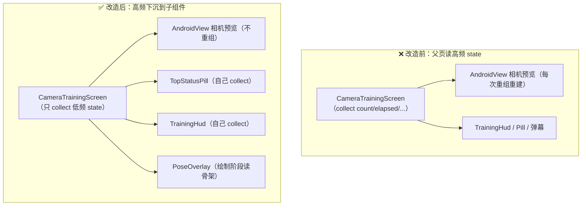

# Compose 高频状态重组优化实战

> 适用：本项目摄像头训练页（`ui/screens/CameraTrainingScreen.kt`）重构沉淀。
> 文档全部基于 `app/src/main/java/...` 真实代码，行号见文中引用。

---

## 1. 背景：摄像头页为什么会卡

摄像头训练页最开始把**每一帧/每一跳都在变**的状态（计数、计时、节奏、连击、积分）直接读在页面（`@Composable fun CameraTrainingScreen` 作用域）。后果：

- 每跳一下 → `_count` 变 → 整个 `CameraTrainingScreen` 重组；
- 重组范围包含相机预览 `AndroidView(PreviewView)` → CameraX 预览被反复重建/重绑定；
- 计时每秒变、积分每跳变、节奏每帧变 → 页面每秒重组合成几十次，低端机直接掉帧、发热。

根因一句话：**把高频 state 放在了父页作用域读，导致整棵子树（甚至整页）为了一个数字的刷新而重组。**

---

## 2. 四条核心原则（本条 = 一行代码约定）

### 原则 1：高频 state 在「子组件内部」`collectAsStateWithLifecycle`

页面作用域**只 collect 低频 state**，高频 state 下放到各自 HUD 子组件内部收集。

`CameraTrainingScreen.kt` 第 104–113 行，页面只收这些（低频）：

```kotlin
val child by session.currentChild.collectAsStateWithLifecycle()
val feedback by vm.feedback.collectAsStateWithLifecycle()
val confetti by vm.confetti.collectAsStateWithLifecycle()
val result by vm.result.collectAsStateWithLifecycle()
val running by vm.running.collectAsStateWithLifecycle()
val paused by vm.paused.collectAsStateWithLifecycle()
val goalReached by vm.goalReached.collectAsStateWithLifecycle()
// ⚠️ 性能约定：count / elapsed / cadence / streak / sessionPoints 都是高频 state，
// 这里一律不读——否则计时每秒、积分每跳都会重组整页（含相机预览 AndroidView），卡顿主因之一。
```

而高频 state 由各子组件自己收集（变化只重组自己）：

```kotlin
// TopStatusPill.kt 内部（第 592 行）——积分+计时
@Composable private fun TopStatusPill(vm: TrainingViewModel) {
    val points by vm.sessionPoints.collectAsStateWithLifecycle()
    val elapsed by vm.elapsed.collectAsStateWithLifecycle()
    ...
}

// TrainingHud.kt 内部（第 674 行）——计数/节奏/连击
@Composable private fun TrainingHud(vm: TrainingViewModel, pulse: MutableState<Float>) {
    val count by vm.count.collectAsStateWithLifecycle()
    val cadence by vm.cadence.collectAsStateWithLifecycle()
    val streak by vm.streak.collectAsStateWithLifecycle()
    ...
}
```

> `TrainingViewModel` 里的状态天然分两档：
> - **高频**：`_count`、`_elapsed`、`_cadence`、`_streak`、`_sessionPoints`、`_mascot`（每秒/每跳变）
> - **低频**：`_running`、`_paused`、`_result`、`_goalReached`（整段训练只变几次）

---

### 原则 2：每帧刷新的 state「只在 Canvas 绘制阶段读」

人体骨架关键点每帧都在变（15fps）。如果把它当普通 `State` 在组合体里读，页面每帧重组——和原则 1 一样灾难。

做法：骨架数据用 `mutableStateOf` 持有，**画面绘制时（Canvas `DrawScope`）才读它**，这样只 `invalidate` 重绘、不触发组合/布局。

`CameraTrainingScreen.kt` 第 117–120 行：

```kotlin
// 最新一帧人体关键点：只交给 PoseOverlay 在「绘制阶段」读取（重绘不重组）
val skeleton = remember { mutableStateOf(emptyList<Pair<Float, Float>>()) }
var hasPose by remember { mutableStateOf(false) }
// 计数瞬间的发光脉冲（0~1）：每跳一下影子伙伴亮一下，只在绘制阶段消费，不引发重组
val pulse = remember { mutableFloatStateOf(0f) }
```

第 419 行：`PoseOverlay(skeleton = skeleton, pulse = pulse, ...)` 在 `Canvas` 里读 `skeleton.value` / `pulse.value` 画骨架，而不在组合阶段读。

回调里也只在「有人↔无人」**状态翻转**时写 `hasPose`（避免每帧写 state 触发页面重组），第 185–190 行：

```kotlin
onLandmarks = { pts ->
    skeleton.value = pts
    val detected = pts.isNotEmpty()
    if (detected != hasPose) hasPose = detected   // 仅翻转时写
}
```

---

### 原则 3：父页只保留「低频 state」

页面本身只依赖低频布尔来排版与决策：

- `running` / `paused` / `result` / `goalReached`（状态切换）
- `hasPose`（是否检测到人 → 决定显示「引导卡」还是「训练 HUD」）
- `dimLight`（画面过暗提示）
- `poseError`（引擎降级提示）

这些值的共同特点：**整段训练里变化次数极少**（每秒最多几次，甚至全程不变），重组它们代价可忽略。

---

### 原则 4：派生低频布尔用 `derivedStateOf`

返回拦截需要知道「是否跳了一些」，但 `count` 是高频 state——直接在 `BackHandler(enabled = ...)` 里读 `count > 0` 会让页面每跳重组一次。

`CameraTrainingScreen.kt` 第 334–335 行：

```kotlin
val countState = vm.count.collectAsStateWithLifecycle()
val hasAnyCount by remember { derivedStateOf { countState.value > 0 } }
```

`hasAnyCount` 只在 **0 ↔ 有数** 翻转那一刻重组一次页面（之后 count 从 5→6→7 不再触发），完美满足「返回拦截条件」这个低频需求。

第 339 行使用：

```kotlin
BackHandler(enabled = (running || paused) && hasAnyCount && result == null) {
    vm.pause()
    showExitPrompt = true
}
```

---

## 3. 反例：在父页读 count 会发生什么

```
父页 collect count
   └─ 每跳 → count.value 变 → CameraTrainingScreen 重组
        ├─ AndroidView(PreviewView) 重组 → CameraX 预览重建（最贵）
        ├─ TopStatusPill / TrainingHud / RewardLayer / DanmakuLayer 全部重组
        └─ 整页 60fps 下每秒重组 60 次 → 低端机 15~20fps、明显卡顿发热
```

改造后：

```
父页只 collect 低频 state（running/paused/hasPose...）
   └─ 高频 state 在各自的子组件内部 collect
        ├─ 计时变 → 只 TopStatusPill 重组（药丸）
        ├─ 计数变 → 只 TrainingHud 重组（数字）
        ├─ 骨架变 → 只 PoseOverlay 绘制阶段重绘（无重组）
        └─ AndroidView(PreviewView) 全程不重组 → 预览稳、不卡
```

---

## 4. 重组范围对比图



---

## 5. 诊断方法（确认优化有效）

1. **Layout Inspector**（Android Studio → View → Tool Windows → Layout Inspector）
   - 勾「Show Recomposition Counts」，看各 Composable 重组次数。
   - 预期：跳 100 下后 `CameraTrainingScreen` 重组次数应接近 0（只在 count 0↔有数 翻转时几次），`TrainingHud` 重组 ≈ 100。
2. **`androidx.compose.ui.tooling` 的 `recomposeHighlighter`**（debug 包）：重组件会闪高亮，一眼看出谁在狂重组。
3. **性能走查**：开 Systrace / Perfetto，看 `Choreographer#doFrame` 里 `Compose` 重组耗时占比。

---

## 6. 避坑清单（本项目已踩过）

- ✅ 高频 state 一律不要在父页作用域 `collect`；下放到子组件。
- ✅ 每帧刷新的数据（骨架/手势轨迹）只进 Canvas 绘制阶段读，不进组合体。
- ✅ 用 `derivedStateOf` 把高频条件派生成低频布尔（返回拦截、可见性等）。
- ✅ 在 `onLandmarks` / `onBrightness` 这类每帧回调里，**只在状态翻转时写 state**（`if (detected != hasPose) hasPose = detected`）。
- ⚠️ `mutableStateOf` 的 `.value` 在 `LaunchedEffect` 里被持续改写时，确认改写逻辑不会每帧重建整个组合（用 `pulse.value` 衰减只改一个浮点，绘制阶段消费，不触发重组）。
- ⚠️ 叠大量 Compose 覆盖层时，`PreviewView` 用 `ImplementationMode.PERFORMANCE`（TextureView）——见 `CameraTrainingScreen.kt` 第 136 行，比默认 `COMPATIBLE`（SurfaceView）更稳、无层级撕裂。

---

## 7. 相关文档

- 摄像头帧节流见 [CAMERAX_THROTTLE.md](CAMERAX_THROTTLE.md)
- 训练/计数状态机见 [ARCHITECTURE.md](ARCHITECTURE.md) 第 5 章与 [docs/ROOM_MIGRATION.md](ROOM_MIGRATION.md)
