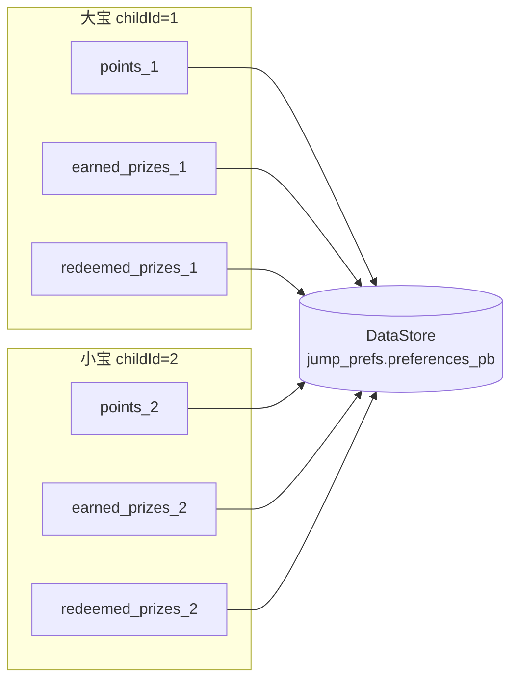

# DataStore 多孩子隔离实战

> 适用：本项目积分/奖励持久化（`data/repository/PreferencesRepository.kt`）+ 训练时批量落盘（`ui/viewmodel/TrainingViewModel.kt`）。
> 文档基于真实代码，行号见引用。

---

## 1. 需求：多孩子互不干扰

「爱跳绳」支持**多个孩子档案**（`Child` 表）。积分与奖品必须**按孩子隔离**——

- 大宝跳了 500 分、解锁了「气球」；
- 小宝登录后是**小宝自己的 0 分**，绝不能看到大宝的分数/奖品。

DataStore 是单文件 KV 存储，没有「按孩子分表」能力。本项目用**动态 key（key 里带 `childId`）** 解决。

---

## 2. 隔离方式：动态 key

`PreferencesRepository.kt` 第 141–160 行，积分/奖品系列用 `childId` 拼进 key：

```kotlin
// ===== 积分与奖励（按孩子隔离：key 里带 childId，多孩子互不干扰） =====
private fun pointsKey(childId: Long) = intPreferencesKey("points_$childId")
private fun prizesKey(childId: Long) = stringSetPreferencesKey("earned_prizes_$childId")
private fun redeemedKey(childId: Long) = stringSetPreferencesKey("redeemed_prizes_$childId")

/** 某个孩子当前累计积分。 */
fun points(childId: Long): Flow<Int> = context.dataStore.data.map { it[pointsKey(childId)] ?: 0 }

/** 已「庆祝过」的奖品 id 集合（解锁庆祝动画只弹一次的去重；≠ 真正兑换）。 */
fun earnedPrizes(childId: Long): Flow<Set<String>> =
    context.dataStore.data.map { it[prizesKey(childId)] ?: emptySet() }

/** 某个孩子已真正兑换的奖品 id 集合，仅由兑换操作手动写入。 */
fun redeemedPrizes(childId: Long): Flow<Set<String>> =
    context.dataStore.data.map { it[redeemedKey(childId)] ?: emptySet() }
```

所有读写都带 `childId` 参数 → 天然的 per-child 命名空间。切孩子即切 key 前缀，零耦合。

---

## 3. 积分增量：批量 flush（不要每跳写盘）

### 3.1 为什么不能每跳写

跳绳每秒 1~3 跳，每跳 +1 分。若每次 `onJump` 都 `dataStore.edit { ... }`：

- `edit` 是**同步事务 + 磁盘写**，每跳一次 I/O；
- DataStore 底层用 `Mutex` + 协程，高频并发写会串行排队、放大延迟；
- 低端机抖动、电量浪费。

### 3.2 做法：内存攒、每 3 秒批量落盘

`TrainingViewModel` 第 110–118 行持有待落盘增量：

```kotlin
/** 待落盘的积分增量：每跳都写 DataStore 太重，攒一段时间批量 flush。 */
private var pendingPoints = 0
private var flushJob: Job? = null
```

`onJump` 每跳只累加内存（`awardPoints`，第 410–416 行，**切主线程**避免与 flush 协程竞争）：

```kotlin
private fun awardPoints(delta: Int) {
    if (delta <= 0) return
    viewModelScope.launch {
        pendingPoints += delta
        _sessionPoints.value += delta
    }
}
```

启动一个**每 3 秒**的 flush 循环（第 419–427 行）：

```kotlin
private fun startFlushLoop() {
    flushJob?.cancel()
    flushJob = viewModelScope.launch {
        while (true) {
            delay(3000)
            flushPoints()
        }
    }
}
```

`flushPoints`（第 430–438 行）把增量一次性写盘，并顺带检查奖品解锁：

```kotlin
private suspend fun flushPoints() {
    val delta = pendingPoints
    if (delta == 0) return
    pendingPoints = 0
    val cid = childId ?: return
    val total = prefs.addPoints(cid, delta)   // 一次 edit 写完
    _totalPoints.value = total
    checkPrizeUnlock(total)
}
```

`addPoints`（`PreferencesRepository.kt` 第 163–170 行）一次事务完成：

```kotlin
suspend fun addPoints(childId: Long, delta: Int): Int {
    var next = 0
    context.dataStore.edit {
        next = ((it[pointsKey(childId)] ?: 0) + delta).coerceAtLeast(0)
        it[pointsKey(childId)] = next
    }
    return next
}
```

> **关键边界**：`stop()`（结束保存）和 `discard()`（清零退出）前都显式 `flushPoints()`，否则最后几秒攒的积分会丢（见 `TrainingViewModel` 第 216 行 `flushPoints()`）。

---

## 4. 两个「奖品」集合的语义区分（别混淆）

`PreferencesRepository` 里 `earned_prizes` 与 `redeemed_prizes` **不是一回事**：

| 集合 | 含义 | 谁写 | 用途 |
|------|------|------|------|
| `earned_prizes_<id>` | 积分跨过门槛、**庆祝动画已弹过** | `TrainingViewModel.checkPrizeUnlock` 自动写 | 去重：同一奖品只弹一次解锁动画 |
| `redeemed_prizes_<id>` | 孩子**真正找家长兑现过** | 「我的」页奖品墙手动确认 | 真正的「已兑换」状态 |

`checkPrizeUnlock`（`TrainingViewModel` 第 445–456 行）注释明确：

```kotlin
// ⚠️ 这里写入的 earned_prizes 集合只用于庆祝去重，≠ 孩子真正兑换；
// 真实兑换在「我的」页奖品墙手动确认，存到 redeemed_prizes。
```

`redeemPrize` / `unredeemPrize`（`PreferencesRepository` 第 177–182 行）只在用户手动操作时调用。

---

## 5. 跨进程挂起会话持久化（顺带）

训练暂停/退出 App 后进程被杀，`TrainingViewModel` 内存状态没了。把会话快照落盘，冷启动后弹「继续/放弃」：

`PreferencesRepository.kt` 第 204–254 行：

```kotlin
data class SuspendedSession(val childId, val count, val elapsedSec, val mode, val sessionPoints)

fun suspendedSession(): Flow<SuspendedSession?>

suspend fun setSuspendedSession(childId, count, elapsedSec, mode, sessionPoints) {
    if (count <= 0) return     // count=0 不存，避免「0 个还问继续」
    ...
}
suspend fun clearSuspendedSession()
```

这部分**不需要按孩子隔离**——`childId` 已作为字段存进快照，`restoreSuspended` 时直接取用（见 [ARCHITECTURE.md](ARCHITECTURE.md) 第 5.6 节）。

浮条位置记忆（`floatBarEdge_v2` / `floatBarY_v2`，第 188–202 行）同理是**全局**的，不按孩子隔离。

---

## 6. 数据隔离架构图



切孩子 = 切 `points_<id>` 前缀，互不串数据。

---

## 7. 避坑清单

- [ ] 所有 per-child 读写都带 `childId`，key 动态拼；**别**用全局固定 key 存孩子数据。
- [ ] 高频增量（每跳积分）**攒批 flush**，别每跳 `edit` 写盘；本项目 3 秒一次。
- [ ] 结束/丢弃前显式 `flushPoints()`，否则末尾积分丢。
- [ ] `addPoints`/`edit` 内对负数 `coerceAtLeast(0)`，积分不为负。
- [ ] 区分 `earned`（庆祝去重）与 `redeemed`（真实兑换）两套集合，语义别混。
- [ ] `childId` 变更时，订阅的 `points(childId)` Flow 要重新 collect（见 `TrainingViewModel.start` 第 186 行 `pointsJob` 重建）。

---

## 8. 相关文档

- 训练状态机/挂起续跳见 [ARCHITECTURE.md](ARCHITECTURE.md) 第 5 章
- 积分规则/等级/奖品库见 `data/model/Rewards.kt`
- Room 持久化（跳绳记录）见 [ROOM_MIGRATION.md](ROOM_MIGRATION.md)
