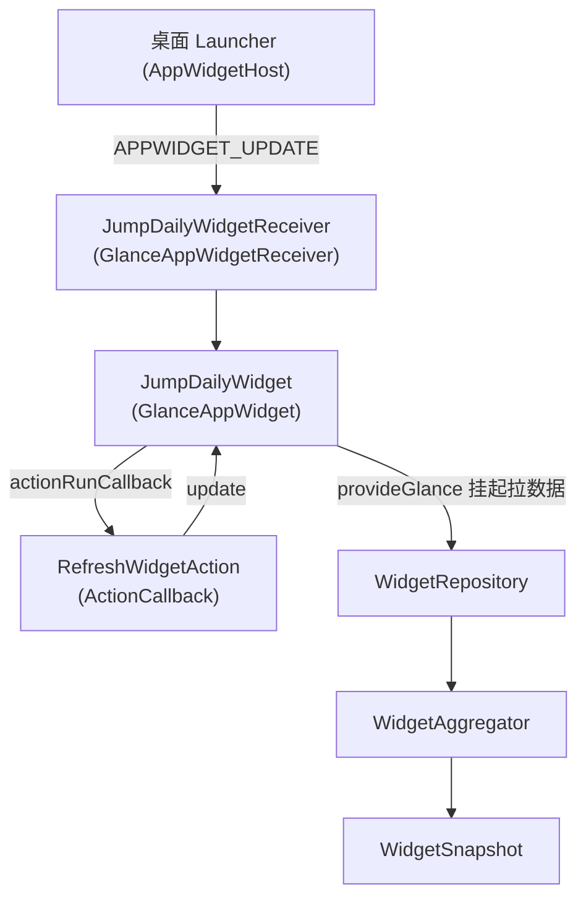

# 桌面小组件（Jetpack Glance 1.1.0）实战

> 基于本仓库 `app/src/main/java/com/jumpdaily/jump/widget/` 真实代码，讲清 Jetpack Glance 声明式 RemoteViews 小组件的落地方式、**1.1.0 的 API 实测坑位**、以及它如何顺手固化一个关键并发认知（「async 异常延迟暴露」）。
> 前置：[`COROUTINE_EXCEPTION_TIMEOUT.md`](./COROUTINE_EXCEPTION_TIMEOUT.md)（协程异常传播）、[`ARCHITECTURE.md`](./ARCHITECTURE.md)（分层与手动 DI）。

---

## 1. 为什么做这个组件

用户指令里**最易 demo、纯本地、无外部账号**的实现项：

- 桌面长按 → 「爱跳绳」小组件，一眼看「今日个数 / 连续天数 / 累计总数」；
- 两个按钮：「刷新」主动拉一次最新数据，「去跳绳」直接打开 App；
- 数据全部来自本机 Room + DataStore，**无网络、无登录、无外部账号**，符合「即点即看」的轻量定位。

---

## 2. 组件架构



| 类 | 文件 | 职责 |
|----|------|------|
| `JumpDailyWidget` | `widget/JumpDailyWidget.kt` | `GlanceAppWidget`，`provideGlance` 挂起拉快照并 `provideContent` 渲染 |
| `JumpDailyWidgetReceiver` | `widget/JumpDailyWidgetReceiver.kt` | 系统广播入口，`glanceAppWidget = JumpDailyWidget()` |
| `RefreshWidgetAction` | `widget/RefreshWidgetAction.kt` | 「刷新」按钮回调，`ActionCallback` → `widget.update(ctx, id)` |
| `WidgetRepository` | `data/repository/WidgetRepository.kt` | 聚合「当前孩子 + 今日/连续/累计」，失败兜底空快照 |
| `WidgetAggregator` | `widget/WidgetAggregator.kt` | 并行聚合 4 个独立数据源（见 §5 并发模式） |
| `WidgetSnapshot` | `data/model/WidgetSnapshot.kt` | 不可变快照 `data class`，含 `empty()` 工厂 |

装配：`JumpDailyApplication` → `AppContainer.widgetRepository`（手动 DI，无 Hilt）。

---

## 3. Glance 1.1.0 实测 API 坑位（已用 javap 从缓存 aar 核对）

> 旧文档 / 直觉与 1.1.0 真实签名差异很大，以下均为**实测**结论，**不要凭记忆**。

### 3.1 `ColorProvider` 是工厂函数，不是构造器

`androidx.glance.unit.ColorProvider` 是**接口**，真正的工厂在 `ColorProviderKt`：

```kotlin
public fun ColorProvider(color: Color): ColorProvider   // 接收 Compose UI Color
public fun ColorProvider(resId: Int): ColorProvider     // 接收 @ColorRes 资源 id
```

- ✅ 正确：`ColorProvider(Color(0xFFF7F7FBuL))`（传入 `androidx.compose.ui.graphics.Color`）。
- ❌ `ColorProvider(0xFFF7F7FB)`：这个字面量 > `Int.MAX_VALUE`，被 Kotlin 推成 `Long`，两个重载都不匹配 → 编译报 `None of the following functions can be called`。
- ❌ 旧记忆里的 `ColorProvider(day, night)` 双参重载 **在 1.1.0 不存在**（那是其他版本/其他包的错误记忆）。
- `Color` / `dp` / `sp` 都来自 **Compose UI**：`androidx.compose.ui.graphics.Color`、`androidx.compose.ui.unit.dp/sp`，**不是** `androidx.glance.unit`。

### 3.2 修饰符扩展在 `androidx.glance.layout`

`fillMaxSize` / `padding` / `width` / `height` 等是 `androidx.glance.layout` 的扩展（不是 `androidx.glance`）。

### 3.3 其它关键包名（实测）

| 用途 | 导入 |
|------|------|
| `provideContent` | `androidx.glance.appwidget.provideContent`（顶层扩展，非成员函数） |
| `actionStartActivity` | 接收 `Intent`（**不是** `ComponentName`） |
| `ActionCallback` | `androidx.glance.appwidget.action.ActionCallback` |
| `ActionParameters` | `androidx.glance.action.ActionParameters` |
| `GlanceAppWidget` / `GlanceAppWidgetReceiver` | `androidx.glance.appwidget` |
| `ColorProvider` | `androidx.glance.unit.ColorProvider` |

### 3.4 没有 `defaultWeight`

1.1.0 的 `Row`/`Column` 修饰符**没有 `defaultWeight`**。需要按比例占空间时用 `Spacer` + 固定 `width`/`height` 或显式 `weight`（若支持）替代。本项目用 `Spacer` 控制间距。

### 3.5 混淆：`ActionCallback` 按类名反射实例化

`actionRunCallback<RefreshWidgetAction>()` 在运行时**按类名反射** `new` 出回调实例，`R8`/混淆会改掉类名导致运行时 `ClassNotFoundException`。`proguard-rules.pro` 已加：

```
-keep class com.jumpdaily.jump.widget.** { *; }
-dontwarn androidx.glance.**
```

> `JumpDailyWidgetReceiver` 在 `AndroidManifest` 里按固定名 `.widget.JumpDailyWidgetReceiver` 注册，混淆也会改它，所以 `widget.**` 整包 keep 最省心。

---

## 4. 数据链路（纯本地、无账号）

```
provideGlance(ctx, id)  // 本身是 suspend，可直接挂起拉数据，无需 runBlocking
  → app.container.widgetRepository.snapshot()
      → prefsRepository.currentChildId.first()   // 无当前孩子 → 空快照
      → WidgetAggregator.aggregate(
            today  = { jumpRepository.todayCountNow(childId) },
            streak = { jumpRepository.streakNow(childId) },
            name   = { childrenRepository.getById(childId)?.name ?: "小朋友" },
            total  = { jumpRepository.totalCountNow(childId) }
        )
  → provideContent { WidgetContent(snapshot, launchIntent) }
```

- `WidgetRepository.snapshot()` 整体 `runCatching { ... }.getOrDefault(WidgetSnapshot.empty())`：任一源抛错 → 兜底空快照，组件永远能渲染（不白屏）。
- `JumpDailyApplication` 的 `container` 是 `lateinit`：`provideGlance` 在 `Application.onCreate` 之前被 host 触发（极少见）会抛 `UninitializedPropertyAccessException`，外层 `try/catch` 兜底空快照。

---

## 5. 顺手固化：「async 异常延迟暴露」

`WidgetAggregator` 把四个**互相独立**的数据源并行拉取，正好用它演示一个最易踩的并发坑，并用单测固化行为。详见 [`COROUTINE_EXCEPTION_TIMEOUT.md`](./COROUTINE_EXCEPTION_TIMEOUT.md) §3.1。

**坑**：`async { }` 的异常挂在 `Deferred` 上，**只有 `await()` 时才抛出**；在 `supervisorScope` 下忘了 `await`，异常被**静默吞掉**。

**本实现（fail-fast）**：

```kotlin
object WidgetAggregator {
    suspend fun aggregate(
        today: suspend () -> Int,
        streak: suspend () -> Int,
        name: suspend () -> String,
        total: suspend () -> Int
    ): WidgetSnapshot = coroutineScope {          // ← coroutineScope，不是 supervisorScope
        val todayDef = async { today() }
        val streakDef = async { streak() }
        val nameDef = async { name() }
        val totalDef = async { total() }
        WidgetSnapshot(                            // 逐一 await：失败在此处立即抛出
            todayCount = todayDef.await(),
            streak = streakDef.await(),
            childName = nameDef.await(),
            totalCount = totalDef.await()
        )
    }
}
```

- 用 `coroutineScope`（**非** `supervisorScope`）：任一源失败 → 取消兄弟并让整体失败，异常**不会**被静默吞；
- 每个结果都显式 `await()`：要么拿到真实值，要么异常在此处立即上抛——把「延迟暴露」转成「在 await 处立即暴露 + 作用域兜底失败」双保险。

**单测固化**（`app/src/test/.../widget/WidgetAggregatorTest.kt`）：

- 某源抛 `RuntimeException("streak source died")` → 断言异常**上抛**（消息匹配），证明没被吞；
- 全成功 → 返回 `WidgetSnapshot("小明", 12, 3, 200)`。

> ⚠️ 测试写法坑：`assertThrows`/`assertFailsWith` 的 lambda **不是协程体**，不能直接调 `suspend` 的 `aggregate`；必须在 `runTest` 协程体内用 `try/catch` 包住，再把异常存到变量断言。

---

## 6. 注册与资源

`AndroidManifest.xml`（`<application>` 内）：

```xml
<receiver
    android:name=".widget.JumpDailyWidgetReceiver"
    android:exported="false"
    android:label="@string/app_name">
    <intent-filter>
        <action android:name="android.appwidget.action.APPWIDGET_UPDATE" />
    </intent-filter>
    <meta-data
        android:name="android.appwidget.provider"
        android:resource="@xml/widget_info" />
</receiver>
```

- `app/src/main/res/xml/widget_info.xml`：`appwidget-provider`，`minWidth=200dp minHeight=110dp`，`updatePeriodMillis=1800000`（30 分钟，系统最短周期），`initialLayout=@layout/glance_loading`。
- `app/src/main/res/layout/glance_loading.xml`：占位 `TextView`（首次 bind 前的 loading）。
- `app/src/main/res/values/strings.xml`：`widget_description` / `widget_loading`。

---

## 7. 真机验证步骤

1. `./gradlew assembleOfficialDebug` 安装到设备；
2. 桌面长按空白处 → 小组件列表选「爱跳绳」→ 拖到桌面；
3. 看是否显示当前孩子的今日/连续/累计；
4. 点「刷新」→ 数据刷新（无网络也能动，纯本地）；
5. 点「去跳绳 🏃」→ 跳回 `MainActivity`；
6. 删 `app/src/main/res/layout/glance_loading.xml` 中占位、改 `widget_info` 尺寸可微调外观。

---

## 8. 已知限制 / 演进

- `updatePeriodMillis` 系统最短 30 分钟，更频繁刷新靠「刷新」按钮主动 `update`（已实现）；
- `provideGlance` 每次都重新 `aggregate` 4 个源，数据量大时可加 `GlanceStateDefinition` 缓存，当前量小无需；
- 组件尺寸固定 `minWidth/minHeight`，未做多尺寸 `appwidget-provider` 配置（横竖/锁频场景可按需扩展）。
