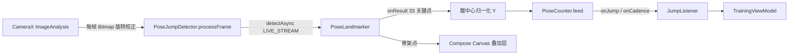

# JumpDaily 专题：MediaPipe 姿态估计实战（含自定义模型训练进阶参考）

> 配套：基于 `app/src/main/java/com/jumpdaily/jump/camera/`（`PoseJumpDetector` / `PoseModelProvider`）、`sensor/PoseCounter`，依赖 `com.google.mediapipe:tasks-vision:0.10.14`。
> 阅读对象：Android 开发者 / 面试复习。
> ⚠️ **准确性声明**：JumpDaily 当前使用的是 MediaPipe **官方预置**模型 `pose_landmarker_lite.task`（见第 1、2 节）。第 4 节「自定义模型训练」为**进阶参考 / 路线规划**，当前项目**并未**训练自定义模型——落地前请按需评估。

---

## 目录

- [1. JumpDaily 当前实现（真实代码）](#1-jumpdaily-当前实现真实代码)
- [2. PoseLandmarker API 与 33 关键点](#2-poselandmarker-api-与-33-关键点)
- [3. 模型加载与体积 / 性能优化](#3-模型加载与体积--性能优化)
- [4. 自定义模型训练（进阶参考，当前未采用）](#4-自定义模型训练进阶参考当前未采用)
- [5. 生产坑（来自本项目真机实测）](#5-生产坑来自本项目真机实测)

---

## 1. JumpDaily 当前实现（真实代码）

### 1.1 数据流（Mermaid）



计数思路：取 33 关键点里**左髋(23)/右髋(24)** 的归一化 Y 均值，交给 `PoseCounter` 做阈值 + 平滑，触发 `onJump`；与传感器计数 `JumpDetector` 共用 `JumpListener` 接口，训练页两套通路无缝切换。

### 1.2 关键配置（`PoseJumpDetector.create`）

```kotlin
val options = PoseLandmarkerOptions.builder()
    .setBaseOptions(BaseOptions.builder().setModelAssetPath(modelPath).build())
    .setRunningMode(RunningMode.LIVE_STREAM)          // 视频/摄像头场景首选
    .setMinPoseDetectionConfidence(0.5f)
    .setMinPosePresenceConfidence(0.5f)
    .setMinTrackingConfidence(0.5f)
    .setResultListener { result, _ -> onResult(result) }
    .build()
landmarker = PoseLandmarker.createFromOptions(context, options)
```

- `createFromOptions` 会**加载模型**（约 5MB lite），务必在后台线程调用（本项目用单线程 `executor`）。
- `RunningMode.LIVE_STREAM`：`detectAsync(image, timestamp)`，**要求时间戳单调递增**（本项目 `frameTs = max(frameTs+1, now)`）。
- 结果回调在 MediaPipe 内部线程，UI 绘制须在 Compose **绘制阶段**读（勿在组合阶段读，否则每帧重组整页——见项目性能约定）。

### 1.3 模型三级加载优先级（`PoseModelProvider`）

```text
1) app/src/main/assets/pose_landmarker.task   → 复制到 filesDir（离线、最稳）
2) filesDir/pose_landmarker.task 已缓存        → 直接复用
3) 官方地址首次联网下载并缓存（需 INTERNET + 联网）
```

官方模型地址（lite / float16 / 约 5MB）：
`https://storage.googleapis.com/mediapipe-models/pose_landmarker/pose_landmarker_lite/float16/1/pose_landmarker_lite.task`

> 本机无网/无法下载时，手动把 `.task` 放进 `app/src/main/assets/` 即可离线使用（代码注释已写明）。

### 1.4 本项目节流与降级（性能约定）

- `ImageAnalysis` 回调加最小间隔 **66ms（≈15fps）**，省 50%+ 的 `toBitmap`/旋转/推理开销；跳绳 1~3 次/秒，15fps 精度足够。
- 原生库**仅 ARM**：x86/x86_64 模拟器上 `System.loadLibrary` 抛 `UnsatisfiedLinkError`，`PoseJumpDetector.create` 用 `catch (e: Throwable)` 兜住并走 `onInitError` 优雅降级（写 `pose_error.txt` 诊断），**绝不崩溃**。
- release 构建 `proguardFiles` 必须用 `proguard-android.txt`（只压缩混淆、**不优化**），否则 R8 优化破坏 MediaPipe/protobuf 的 `<clinit>`，release 下 `ExceptionInInitializerError`（debug 不优化故正常）。

---

## 2. PoseLandmarker API 与 33 关键点

### 2.1 三种 RunningMode

| 模式 | 方法 | 适用 |
|------|------|------|
| `IMAGE` | `detect(image)` 同步返回 | 单张图推理 |
| `VIDEO` | `detectForVideo(image, ts)` | 已解码的视频帧序列 |
| `LIVE_STREAM` | `detectAsync(image, ts)` + 回调 | **摄像头实时**（本项目） |

### 2.2 BlazePose 33 关键点拓扑（常用索引）

```text
0  鼻            11 左肩   12 右肩   13 左肘   14 右肘
15 左腕   16 右腕   23 左髋   24 右髋   25 左膝   26 右膝
27 左踝   28 右踝   29-32 左脚   31-32 右脚
（其余：眼/耳/嘴/食指/髋中线等，详见 MediaPipe 官方拓扑图）
```

- 每个 `landmark` 提供 `.x()` `.y()` `.z()` `.visibility()`，坐标**归一化到 [0,1]**（相对图像宽高），与分辨率无关。
- 多人场景 `result.landmarks()` 返回 `List<List<Landmark>>`，本项目取 `persons[0]`（画面第一人）。
- 模型变体：`lite`（快/小） / `full` / `heavy`（准/慢/大）；本项目选 `lite` 平衡低端机性能。

### 2.3 置信度阈值怎么设

- `minPoseDetectionConfidence`：整人检测置信度（0.5 通用起点）。
- `minPosePresenceConfidence`：单帧存在置信度。
- `minTrackingConfidence`：跨帧跟踪稳定性（摄像头抖动大时降到 0.3~0.4 更跟手）。
- 跳绳这种**大幅、快速、重复**动作，建议实测后把 tracking 调到 0.4 左右，避免频繁丢失导致计数抖动。

---

## 3. 模型加载与体积 / 性能优化

- **内嵌 vs 动态下载**：内嵌 `.task` 进 `assets` 体验最稳（首启即用、无联网依赖），代价是 APK +5MB；动态下载省体积但依赖联网与 `INTERNET` 权限（本项目两者结合：assets 优先，缺失再下载）。
- **仅 ARM 原生库**：release `ndk { abiFilters += "armeabi-v7a","arm64-v8a" }`，剔除 x86 库（发布无意义，且 MediaPipe 本就不提供 x86 原生库）。
- **资源裁剪**：`resourceConfigurations += "zh","zh-rCN","zh-rTW"` 剔除非中文字符串，显著减小包体。
- **R8 不优化**：见 1.4（release-only 崩溃根因）。
- **节流**：15fps 足够跳绳计数，省 CPU/电量（见 1.4）。

---

## 4. 自定义模型训练（进阶参考，当前未采用）

> 本节是**路线规划**，不是 JumpDaily 现状。是否落地取决于「预置 lite 模型在你们目标机型上的准确率/延迟是否达标」。

### 4.1 何时需要自定义模型

- 目标设备太弱，lite 仍卡 → 想训更小的专属模型。
- 要识别**特定动作语义**（不仅是「人在不在」），如「跳绳 vs 原地跑 vs 走路」「节奏稳不稳」——这本质是**动作分类**，不是换 landmarker。
- 数据隐私：必须完全离线、不自带 Google 模型权重的合规要求。

### 4.2 现实可行路径 A：动作分类器（最贴合 JumpDaily）

MediaPipe **Model Maker** 提供 `PoseClassifier`，直接在 PoseLandmarker 输出的 33 关键点序列上训练分类器，导出 `.task`，替换 `assets/pose_landmarker.task` 即可，**无需改动推理代码**。

数据准备：
1. 用现成 `PoseLandmarker` 把标注好的跳绳视频抽成关键点 CSV（每帧 33 点归一化坐标 + 标签）。
2. 按类别组织：`train/jump/`、`train/other/`、`val/jump/`、`val/other/`。

```python
# Google Colab: pip install mediapipe-model-maker tensorflow
from mediapipe_model_maker import pose_classifier

dataset = pose_classifier.Dataset.from_folder("path/to/data", csv=True)
model = pose_classifier.PoseClassifier.create(
    train_data=dataset,
    validation_data=dataset,
    batch_size=16, epochs=20, learning_rate=0.001,
    model_options=pose_classifier.ModelOptions(
        model_name="pose_embedding"
    ),
)
model.export_model("exported")   # 产出 pose_classifier.task
```

集成：把 `pose_classifier.task` 放入 `app/src/main/assets/`，并将 `PoseModelProvider.MODEL_URL`/资源名指向它；推理改用 `PoseClassifier`（`recognize(landmarkerResult)` 或 `classify(image)`），得到「jump / other」概率。

> 这条路线**收益最大、成本最低**：不碰底层 landmarker 训练，只训顶层分类，几十段视频即可见效。

### 4.3 现实可行路径 B：替换姿态 landmarker 本身

若要改关键点拓扑 / 更高精度，需自训 BlazePose 风格模型并导出 TFLite，再用 MediaPipe 工具封装成 `.task`：

```python
# 用 mediapipe Python 包把 TFLite 封装为 .task
import mediapipe.tasks.python.vision as vision
# 或 Model Maker / Bazel graph 导出；过程较重，一般跳绳场景不需要
```

- 训练框架：TensorFlow + 自建姿态数据集（COCO / MPII 风格或自有标注）。
- 导出：`TFLite` → MediaPipe `ModelBundle`（`convert_to_task`）→ `.task`。
- 风险：重训 + 重新标定置信度阈值 + 端到端延迟回归，工作量显著。

### 4.4 训练→集成核对清单

- [ ] 动作类别定义清晰（jump / not-jump / 节奏好 / 节奏差）。
- [ ] 训练集覆盖目标机型、光照、衣物（裤装 vs 裙装对髋/膝点影响大）。
- [ ] 真机跑同一批标注帧，分类准确率 ≥ 95%，端到端延迟 ≤ 66ms/帧（保 15fps）。
- [ ] 替换 `assets/pose_landmarker.task` 后重测 `PoseJumpDetector` 初始化与计数。
- [ ] release 包（proguard-android.txt）真机验证不崩、不丢精度。

---

## 5. 生产坑（来自本项目真机实测）

1. **R8 不能优化**：release `proguardFiles` 用 `proguard-android.txt`，否则 `ExceptionInInitializerError`（见 1.4）。
2. **原生库仅 ARM**：x86 模拟器必崩，必须 `catch (Throwable)` 优雅降级（见 1.4、PoseJumpDetector.create）。
3. **LIVE_STREAM 时间戳单调**：`frameTs = max(frameTs+1, System.currentTimeMillis())`，否则 `detectAsync` 丢帧/异常。
4. **模型下载需联网 + INTERNET 权限**：无网环境务必内嵌 `.task` 到 `assets`（PoseModelProvider 备注已说明）。
5. **每帧开销大**：`toBitmap` + 旋转 + 推理，必须节流（本项目 15fps），否则发热掉帧。
6. **关键点回调在子线程**：UI 叠加层绘制要在 Compose draw 阶段读状态，别在组合阶段读（否则整页每帧重组，含相机预览 AndroidView）。
7. **diagnosis 用文件落盘**：release 下 `Log.wtf` 可能被 R8/厂商吞；致命状态写 `pose_error.txt`，`adb pull` 读取（本项目已落地）。

---

*文档随代码演进维护；如相机/模型相关实现有重要变更，请同步更新本文件与 CHANGELOG.md。*
