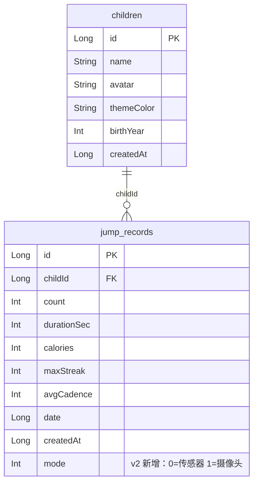

# JumpDaily 专题：Room Migration 实战

> 配套：基于 `app/src/main/java/com/jumpdaily/jump/data/local/` 真实代码（Room 2.6.1）。
> 阅读对象：Android 开发者 / 面试复习。本文所有代码片段均可直接落到本项目。

---

## 目录

- [1. 当前 Room 现状（JumpDaily 真实代码）](#1-当前-room-现状jumpdaily-真实代码)
- [2. 为什么必须告别 destructiveMigration](#2-为什么必须告别-destructivemigration)
- [3. 手写 Migration：v1 → v2 实战](#3-手写-migrationv1--v2-实战)
- [4. exportSchema + 方案 JSON 校验](#4-exportschema--方案-json-校验)
- [5. 迁移测试（room-testing，防止升级炸库）](#5-迁移测试room-testing防止升级炸库)
- [6. AutoMigration：Room 2.4+ 的省心方案](#6-automigrationroom-24-的省心方案)
- [7. 上线清单与常见坑](#7-上线清单与常见坑)

---

## 1. 当前 Room 现状（JumpDaily 真实代码）

`AppDatabase.kt` 现状：

```kotlin
@Database(
    entities = [Child::class, JumpRecord::class],
    version = 1,
    exportSchema = false                       // ⚠️ 关掉了方案导出，迁移无法被静态校验
)
abstract class AppDatabase : RoomDatabase() {
    abstract fun childDao(): ChildDao
    abstract fun jumpRecordDao(): JumpRecordDao

    companion object {
        @Volatile private var INSTANCE: AppDatabase? = null
        fun getInstance(context: Context): AppDatabase =
            INSTANCE ?: synchronized(this) {
                INSTANCE ?: Room.databaseBuilder(
                    context.applicationContext,
                    AppDatabase::class.java,
                    "jump_daily.db"
                )
                    .fallbackToDestructiveMigration()   // ⚠️ 版本号一变就清空整库
                    .build()
                    .also { INSTANCE = it }
            }
    }
}
```

两张表（来自 `data/local/entities/`）：

| 表 | Entity | 关键列 |
|----|--------|--------|
| `children` | `Child` | `id`(PK autogen), `name`, `avatar`(默认🐰), `themeColor`(默认#FF8FD3), `birthYear`, `createdAt` |
| `jump_records` | `JumpRecord` | `id`(PK autogen), `childId`, `count`, `durationSec`, `calories`, `maxStreak`, `avgCadence`, `date`, `createdAt`；索引 `childId`/`date` |

Dao 已稳定的查询（`JumpRecordDao` / `ChildDao`）：按孩子观察记录流、按日期区间统计、累计/最佳/当日/活跃天数聚合、按孩子删除等。

**结论**：schema 已稳定，但当前用 `fallbackToDestructiveMigration()` + `exportSchema=false`，一旦 `version` 升到 2 却没有 Migration，**所有孩子的跳绳记录会被静默清空**——这是上线绝对不能接受的行为。

---

## 2. 为什么必须告别 destructiveMigration

| 策略 | 行为 | 适用阶段 |
|------|------|----------|
| `fallbackToDestructiveMigration()` | 找不到匹配 Migration 就**删表重建** | 仅本地 Demo / 开发早期 |
| `fallbackToDestructiveMigrationOnDowngrade()` | 仅降级时破坏，升级必须自己写 Migration | 较安全的中间态 |
| 显式 `addMigrations(M1_2, …)` | **保留数据**地演进 schema | 生产必选 |
| `addMigrations(M1_2).fallbackToDestructiveMigrationOnDowngrade()` | 升级保数据，降级清空（用户回滚旧版时数据本就不可用） | 生产推荐 |

> 经验法则：只要 DB 里存了**用户生成内容**（跳绳记录、成就、设置），version ≥ 2 起就必须有手写/Auto Migration，绝不能再靠 destructive fallback 兜底升级。

---

## 3. 手写 Migration：v1 → v2 实战

**场景**：JumpDaily 同时支持「传感器计数」与「摄像头姿态计数」两种通路，落库时需要区分来源，便于后续统计「哪种方式更准」。给 `jump_records` 加 `mode` 列（0=传感器，1=摄像头）。

### 3.1 定义 Migration 对象

放在 `AppDatabase.kt` 同包（或 `data/local/Migrations.kt`）：

```kotlin
import androidx.room.migration.Migration
import androidx.sqlite.db.SupportSQLiteDatabase

// 升级路径必须覆盖「连续区间」：1→2、2→3、1→3(可由 1→2 + 2→3 组合)，
// Room 会自动把 M1_2 + M2_3 串成 1→3。但 1→3 缺中间任一段都会退化成 destructive。
val MIGRATION_1_2 = object : Migration(1, 2) {
    override fun migrate(db: SupportSQLiteDatabase) {
        // 新增 NOT NULL 列必须有 defaultValue，否则旧行无值会直接抛异常升级失败
        db.execSQL(
            "ALTER TABLE jump_records ADD COLUMN mode INTEGER NOT NULL DEFAULT 0"
        )
    }
}
```

### 3.2 同步改 Entity（字段 <-> 列对齐）

```kotlin
@Entity(
    tableName = "jump_records",
    indices = [Index("childId"), Index("date")]
)
data class JumpRecord(
    @PrimaryKey(autoGenerate = true) val id: Long = 0,
    val childId: Long,
    val count: Int,
    val durationSec: Int,
    val calories: Int,
    val maxStreak: Int,
    val avgCadence: Int,
    val date: Long,
    val createdAt: Long = System.currentTimeMillis(),
    // 与 migrate() 里的新列一一对应；defaultValue 让 Room 在 INSERT 时补默认，
    // 也供未来的 AutoMigration 推断出「可安全加 NOT NULL 列」
    @ColumnInfo(name = "mode", defaultValue = "0") val mode: Int = 0
)
```

> 列名用 `@ColumnInfo(name=…)` 显式绑定；`defaultValue` 字符串是 Room 的**建表/迁移提示**，必须和 `migrate()` 里的 `DEFAULT 0` 保持一致。

### 3.3 接上 Migration

```kotlin
@Database(
    entities = [Child::class, JumpRecord::class],
    version = 2,                       // ← 升版本
    exportSchema = true                // ← 打开，见第 4 节
)
abstract class AppDatabase : RoomDatabase() {
    abstract fun childDao(): ChildDao
    abstract fun jumpRecordDao(): JumpRecordDao

    companion object {
        @Volatile private var INSTANCE: AppDatabase? = null

        fun getInstance(context: Context): AppDatabase =
            INSTANCE ?: synchronized(this) {
                INSTANCE ?: Room.databaseBuilder(
                    context.applicationContext,
                    AppDatabase::class.java,
                    "jump_daily.db"
                )
                    .addMigrations(MIGRATION_1_2)                    // ← 注册迁移
                    .fallbackToDestructiveMigrationOnDowngrade()     // 仅降级清空，升级保数据
                    .build()
                    .also { INSTANCE = it }
            }
    }
}
```

**schema 演进示意（Mermaid）**：



---

## 4. exportSchema + 方案 JSON 校验

打开 `exportSchema = true` 后，kapt 会在编译期把每个版本的 schema 导出成 JSON，供 **Migration 测试**和 **Schema 比对工具**使用。

在 `app/build.gradle.kts` 的 `android { }` 内添加（项目用 **kapt**，不是 ksp）：

```kotlin
android {
    defaultConfig {
        // Room 把各版本 schema 导出到 schemas/，需提交进 git 以便迁移校验
        kapt {
            arguments {
                arg("room.schemaLocation", "$projectDir/schemas")
            }
        }
    }
}
```

- 编译后会生成 `app/schemas/com.jumpdaily.jump.data.local.AppDatabase/1.json`、`2.json`。
- **务必把 `schemas/` 提交到版本库**（属于源码级契约，不是构建产物）。否则迁移测试读不到旧版本方案。
- `git check-ignore app/schemas` 应无输出（当前 `.gitignore` 未忽略它，正常）。

---

## 5. 迁移测试（room-testing，防止升级炸库）

Room 提供 `room-testing` 的 `MigrationTestHelper`，能在**插桩测试（androidTest）**里：用旧版本方案建库 → 灌入真实形态数据 → 跑迁移 → 校验新库结构与数据完整性。

### 5.1 加依赖

```kotlin
androidTestImplementation("androidx.room:room-testing:2.6.1")
```

### 5.2 迁移测试示例

```kotlin
@RunWith(AndroidJUnit4::class)
class AppDatabaseMigrationTest {

    // Room 会按 schemas/ 下的 JSON 校验迁移后结构是否与当前 Entity 完全一致
    @get:Rule
    val helper = MigrationTestHelper(
        InstrumentationRegistry.getInstrumentation(),
        AppDatabase::class.java
    )

    @Test
    fun migrate1To2_keepsData_and_addsModeColumn() {
        // 1) 用 v1 方案建库并插入一行（不带 mode 列）
        helper.createDatabase("jump_daily.db", 1).apply {
            execSQL(
                """INSERT INTO jump_records
                   (childId,count,durationSec,calories,maxStreak,avgCadence,date,createdAt)
                   VALUES (1, 120, 60, 8, 30, 120, 1725705600000, 1725705600000)"""
            )
            close()
        }

        // 2) 以 v2 + MIGRATION_1_2 重新打开，自动执行迁移并校验结构
        helper.runMigrationsAndValidate("jump_daily.db", 2, true, MIGRATION_1_2).use { db ->
            val c = db.query("SELECT count, mode FROM jump_records")
            assertTrue(c.moveToFirst())
            assertEquals(120, c.getInt(c.getColumnIndexOrThrow("count")))
            assertEquals(0, c.getInt(c.getColumnIndexOrThrow("mode"))) // 旧行默认值 0
            c.close()
        }
    }
}
```

> 要点：`runMigrationsAndValidate` 的第三个参数 `true` 表示「迁移后把库结构和最新 `@Entity` 导出的方案做严格比对」——任何列名/类型/约束不一致都会直接失败，等于把迁移写错挡在 CI。

---

## 6. AutoMigration：Room 2.4+ 的省心方案

对于**纯增量**变更（加列、加表、加索引），Room 2.4+ 支持 `AutoMigration`，连 `Migration` 对象都不用写：

```kotlin
@Database(
    entities = [Child::class, JumpRecord::class],
    version = 2,
    exportSchema = true,
    autoMigrations = [AutoMigration(from = 1, to = 2)]
)
abstract class AppDatabase : RoomDatabase() { /* … */ }
```

**AutoMigration 能自动处理的**：
- 新增带 `@ColumnInfo(defaultValue=…)` 的列（NOT NULL 必须有 defaultValue）
- 新增 Entity（新表）
- 新增索引

**AutoMigration 处理不了、必须写 `AutoMigrationSpec` 的**：
- 列改名（`@ColumnInfo(fromColumns=[…], toColumns=[…])`）
- 列类型变更 / 删除列（破坏性，需要 `onDelete` 策略）
- 表拆分 / 数据转换

> 本项目 v1→v2（加 `mode` 列带默认值）**两者都行**；首次落地建议用手写 Migration，逻辑最透明、最好测，也最能应对后续复杂演进。

---

## 7. 上线清单与常见坑

- [ ] `version` 升级时，已为**每一条连续升级路径**（1→2、2→3…）提供 Migration 或 AutoMigration。
- [ ] 新增 NOT NULL 列务必带 `DEFAULT`，否则旧数据行升级即崩。
- [ ] 改 Entity 后**重编**以刷新 `schemas/*.json`，并把 `schemas/` 提交 git。
- [ ] 迁移必须有 `room-testing` 用例覆盖（从各历史版本升到最新版本）。
- [ ] 真机验收：拿一个**装了旧版的旧设备/旧 APK**，升级安装新版本，确认记录、成就、设置都还在。
- [ ] 降级（version 变小）默认抛 `IllegalStateException`；如需允许用户回装旧版，配 `fallbackToDestructiveMigrationOnDowngrade()`。
- [ ] 切勿对生产库用 `fallbackToDestructiveMigration()` 兜底升级——它会悄悄清空用户数据。
- [ ] 多进程访问同一 DB 要用 `enableMultiInstanceInvalidation()`，否则进程间数据不刷新（本项目单进程，暂不需要）。

> 踩坑最贵的一条：**destructive fallback 上线**。开发期图省事开着，某次发版升了 version 却忘了写 Migration，结果线上用户更新后被清空全部跳绳记录与成就——务必靠迁移测试 + CI 卡死。
