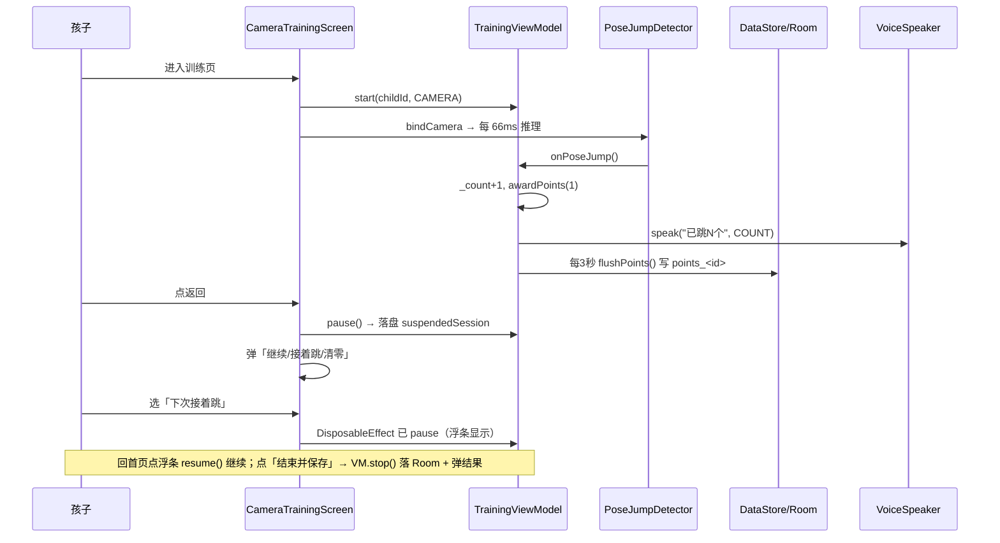

# JumpDaily 源码导览与阅读顺序

> 目标：帮你在最短时间内**看懂整个项目**，并知道「想改某功能时该动哪个文件」。
> 文档基于 `app/src/main/java/com/jumpdaily/jump/...` 真实结构（2026-09-09 状态）。
> 先看 [ARCHITECTURE.md](ARCHITECTURE.md) 与 [TECH_STACK.md](TECH_STACK.md) 了解全局，本文是「按图索骥」的操作手册。

---

## 一、建议先看什么（文档门槛排序）

| 顺序 | 文档 | 作用 | 耗时 |
|------|------|------|------|
| 1 | [README.md](../README.md) | 功能清单、孩子向定位 | 5 min |
| 2 | [docs/ARCHITECTURE.md](ARCHITECTURE.md) | 模块划分、数据流、深度专题索引 | 15 min |
| 3 | [docs/TECH_STACK.md](TECH_STACK.md) | 依赖、Gradle、各技术点落点 | 15 min |
| 4 | 本文 SOURCE_TOUR | 文件清单 + 阅读顺序 + 跑起来 | 10 min |
| 5 | 5 份深度专题（按需） | Compose 重组 / TTS 仲裁 / R8 / CameraX / DataStore | 各 10 min |

---

## 二、项目结构全景

```
JumpDaily/
├── app/
│   ├── build.gradle.kts          # 构建：渠道/签名/R8/产物命名（核心）
│   ├── proguard-rules.pro        # 混淆 keep 规则
│   └── src/main/
│       ├── AndroidManifest.xml    # 权限/CHANNEL meta-data/入口
│       ├── assets/
│       │   ├── pose_landmarker_lite.task   # MediaPipe 预置模型
│       │   └── voice/*.wav                 # 离线语音包（sha1 命名）
│       ├── java/com/jumpdaily/jump/
│       │   ├── JumpDailyApplication.kt     # Application：建 DI 容器 + WorkManager 配置
│       │   ├── MainActivity.kt             # 入口 Activity：setContent(AppRoot)
│       │   ├── di/AppContainer.kt          # 手动依赖装配（无 Hilt）
│       │   ├── ui/
│       │   │   ├── navigation/AppRoot.kt   # 导航 + 底部 4 tab + 跳绳浮条 + 挂起恢复
│       │   │   ├── screens/                # 各页面（Home/Training/Camera/Stats/Achievements/Profile/Settings/Children/Splash/Privacy）
│       │   │   ├── viewmodel/              # 5 个 VM（Training/Session/Records/Children/Settings）
│       │   │   ├── components/             # 复用 UI（CuteButton/PageHeader/Danmaku/FloatingJumpBar/PoseOverlay...）
│       │   │   └── theme/                  # Color/Theme/Dimens（卡哇伊夜间双主题）
│       │   ├── data/
│       │   │   ├── local/                  # Room：AppDatabase + 2 Dao + 2 Entity
│       │   │   ├── model/                  # Rewards（积分规则）/Badge/CountMode
│       │   │   └── repository/             # Children/Jump/Preferences 三个 Repository
│       │   ├── audio/                      # VoiceSpeaker（TTS 仲裁）/Encouragements（语料）/SoundPlayer
│       │   ├── camera/                     # PoseJumpDetector / PoseModelProvider / PoseSkeleton / PoseCounter
│       │   ├── sensor/                     # JumpDetector（传感器启发式计数）
│       │   ├── reminder/                   # ReminderScheduler / ReminderWorker（WorkManager 提醒）
│       │   └── util/DateUtils.kt           # 日期工具
│       └── res/                            # 主题/字符串/图标（自适应 XML 图标）
├── tools/                          # 一键打包 bat/sh + 语音包生成/校验脚本
├── docs/                           # 本文档所在：架构/技术栈/5 专题/本导览
├── CHANGELOG.md / README.md
└── local.properties ★             # 密钥（gitignore，不存在也能构建）
```

---

## 三、推荐阅读顺序（按模块，带文件）

按「骨架 → 数据 → 能力 → UI」四步走，每步都先读一个入口文件：

### 第 1 步：应用骨架（30 min）
1. `JumpDailyApplication.kt` —— 创建 `AppContainer`，提供 WorkManager 配置。
2. `MainActivity.kt` —— `setContent { AppRoot(container) }`，极薄。
3. `di/AppContainer.kt` —— **所有依赖在这里组装**，看懂它就看懂全局对象图（DB/Repository/VoiceSpeaker/VM Factory）。
4. `ui/navigation/AppRoot.kt` —— 路由表（`Screen` 密封类 + `NavHost`）、底部 4 tab、浮条、跨进程挂起恢复弹框。

### 第 2 步：数据层（40 min）
5. `data/local/AppDatabase.kt` + `entities/Child.kt` + `entities/JumpRecord.kt` —— Room v1 两张表。
6. `data/local/JumpRecordDao.kt` + `ChildDao.kt` —— 查询定义。
7. `data/repository/PreferencesRepository.kt` —— **DataStore 全局偏好 + 按孩子隔离的积分/奖品/挂起快照**（深度见 [DATASTORE_MULTICHILD.md](DATASTORE_MULTICHILD.md)）。
8. `data/model/Rewards.kt` —— 积分规则、等级、奖品库（儿童向设计）。
9. `data/repository/ChildrenRepository.kt` + `JumpRepository.kt` —— 业务聚合。

### 第 3 步：核心能力（1 h）
10. `audio/VoiceSpeaker.kt` —— TTS 全局仲裁（[TTS_ARBITRATION.md](TTS_ARBITRATION.md)）。
11. `audio/Encouragements.kt` —— 鼓励语料池（9 场景）。
12. `camera/PoseModelProvider.kt` + `camera/PoseJumpDetector.kt` —— 模型三级加载 + 帧节流推理。
13. `sensor/JumpDetector.kt` —— 传感器启发式计数（摄像头之外的另一种计数方式）。
14. `reminder/ReminderScheduler.kt` + `ReminderWorker.kt` —— WorkManager 每日提醒。

### 第 4 步：UI 与状态（1 h，重点）
15. `ui/viewmodel/TrainingViewModel.kt` —— **训练核心状态机**：计数/节奏/积分/反馈/暂停/挂起/丢弃（5 专题都引用它）。
16. `ui/screens/CameraTrainingScreen.kt` —— Compose 高频重组优化范本（[COMPOSE_RECOMPOSITION.md](COMPOSE_RECOMPOSITION.md) + [CAMERAX_THROTTLE.md](CAMERAX_THROTTLE.md)）。
17. `ui/screens/TrainingScreen.kt` —— 传感器训练页（与摄像头页共享 TrainingViewModel）。
18. `ui/screens/HomeScreen.kt` / `StatsScreen.kt` / `AchievementsScreen.kt` / `ProfileScreen.kt` —— 四个主 tab。
19. `ui/components/` 挑几个关键的看：`CuteButton`、`PageHeader`、`FloatingJumpBar`、`PoseOverlay`、`DanmakuOverlay`、`JumpMascot`。

> **一句话主线**：`AppContainer` 组装依赖 → `AppRoot` 导航 → 用户在某 Screen 操作 → 调对应 `ViewModel` → ViewModel 读写 `Repository`/`Room`/`DataStore` 并驱动 `audio`/`camera` 能力 → UI 通过 `collectAsStateWithLifecycle` 反映状态。

---

## 四、在 IDE 里怎么打开（操作步骤）

1. **打开工程**：Android Studio → Open → 选 `D:\SmallTools\JumpDaily`（含 `settings.gradle` 的目录）。
2. **等同步**：Gradle sync 完（首次会下依赖；本机用阿里云镜像 `maven.aliyun.com`，较快）。
3. **关键窗口布局**：
   - 左：Project 视图切到 `Android` 模式，展开 `app/java/com.jumpdaily.jump`。
   - 右：打开 `AppContainer.kt`，按 `Ctrl/Cmd+B`（Go To Declaration）顺着 `container.xxx` 跳进各依赖，**顺着调用链读**比从头读快得多。
4. **全局搜索**：`Shift` 两次（Search Everywhere）输入类名，如 `TrainingViewModel` 看谁在用。
5. **看调用关系**：在某方法上 `Ctrl+Alt+H`（Call Hierarchy）看谁调它、它调谁。
6. **真机/模拟器联动**：见下一节。

---

## 五、怎么跑起来（具体操作顺序）

### 5.1 构建
```bash
cd D:\SmallTools\JumpDaily
# 调试包（可断点，未混淆）
./gradlew assembleDebug
# 或一键脚本（推荐，含命名+归档）：
#   tools/build_apk.sh [all|official|huawei|xiaomi] [release|debug] [install]
tools/build_apk.sh huawei debug
```
> Windows 用 `tools/build_apk.bat`；一键脚本自动设 `JAVA_HOME`/`ANDROID_HOME`。

### 5.2 模拟器（无摄像头，验证 UI/逻辑）
- Android Studio → Device Manager → 建 Pixel（API 34）→ 跑 `app` Run 配置。
- 摄像头姿态页在**模拟器会优雅降级**（x86 缺 MediaPipe 原生库，`poseError` 提示），可切「传感器模式」计数。

### 5.3 真机（华为，验证摄像头全功能）
设备序列号 `2NSDU20917009254`。命令（Git Bash / PowerShell 均可）：
```bash
# 1) 解锁常亮 + 唤醒（避免安装时锁屏卡住）
adb shell svc power stayon true
adb shell input keyevent KEYCODE_WAKEUP

# 2) 装 debug 包（华为会弹安装风控，需手动点「安装」/输锁屏密码）
adb install -r app/build/outputs/apk/huawei/debug/JumpDaily_v1.0.0_huawei_debug_YYYYMMDD.apk
#   若卡在风控：用 huawei-adb-install-riskcontrol 技能自动处理

# 3) 启动 + 验收后拉诊断
adb pull /sdcard/Android/data/com.jumpdaily.jump/files/tts_init.txt ./
adb pull /sdcard/Android/data/com.jumpdaily.jump/files/pose_error.txt ./
```
> 华为 EMUI 下 release 包 logcat 常被吞，**调试致命状态一律看这两个 txt**（详见 [R8_RELEASE.md](R8_RELEASE.md)）。

---

## 六、一次跳绳的生命周期（数据流走查）



---

## 七、想改某功能，改哪个文件（速查表）

| 你想改的东西 | 去哪 |
|------|------|
| 加一个训练页语音/提示 | `audio/Encouragements.kt`（语料）+ `TrainingViewModel` 调用 + 显式 `VoicePriority` |
| 调整积分规则/等级/奖品 | `data/model/Rewards.kt` |
| 改全局设置项（目标/提醒/语音开关） | `data/repository/PreferencesRepository.kt` + `ui/viewmodel/SettingsViewModel.kt` |
| 改跳绳记录存储/统计 | `data/local/*` + `data/repository/JumpRepository.kt` + `ui/viewmodel/RecordsViewModel.kt` |
| 改底部 tab / 路由 / 浮条 | `ui/navigation/AppRoot.kt` |
| 改训练页 UI/性能 | `ui/screens/CameraTrainingScreen.kt`（重组优化见 [COMPOSE_RECOMPOSITION.md](COMPOSE_RECOMPOSITION.md)） |
| 改姿态识别精度/帧率 | `camera/PoseJumpDetector.kt` + `CameraTrainingScreen.bindCamera`（节流见 [CAMERAX_THROTTLE.md](CAMERAX_THROTTLE.md)） |
| 改打包/渠道/签名/命名 | `app/build.gradle.kts` + `tools/build_apk.*` |
| 改主题/颜色/尺寸 | `ui/theme/Color.kt` + `Theme.kt` + `Dimens.kt` |
| 加每日提醒 | `reminder/ReminderScheduler.kt` + `ReminderWorker.kt` |
| 修 release 崩溃/日志 | 看 [R8_RELEASE.md](R8_RELEASE.md)，先 `adb pull` 两个 txt |

---

## 八、给新人的 3 条铁律（本项目血泪）

1. **高频 state 别在父页读**（Compose 卡顿根因）——见 [COMPOSE_RECOMPOSITION.md](COMPOSE_RECOMPOSITION.md)。
2. **所有 `speak` 走 `VoiceSpeaker` 并显式传 `VoicePriority`**，新通道共用 `lastFeedbackTs` 别另起节流——见 [TTS_ARBITRATION.md](TTS_ARBITRATION.md)。
3. **release 用 `proguard-android.txt` 别用 `-optimize.txt`**；调试看文件落盘别只看 logcat——见 [R8_RELEASE.md](R8_RELEASE.md)。

---

## 九、相关文档

- 全局架构：[ARCHITECTURE.md](ARCHITECTURE.md)
- 技术栈：[TECH_STACK.md](TECH_STACK.md)
- 5 份深度专题：[COMPOSE_RECOMPOSITION.md](COMPOSE_RECOMPOSITION.md) · [TTS_ARBITRATION.md](TTS_ARBITRATION.md) · [R8_RELEASE.md](R8_RELEASE.md) · [CAMERAX_THROTTLE.md](CAMERAX_THROTTLE.md) · [DATASTORE_MULTICHILD.md](DATASTORE_MULTICHILD.md)
